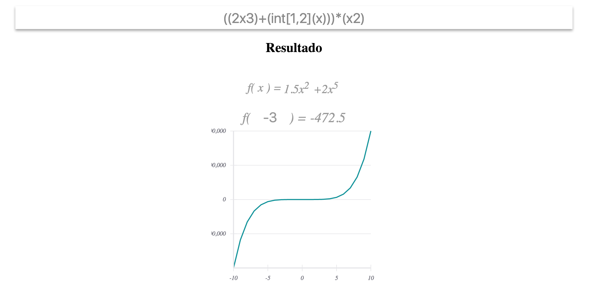
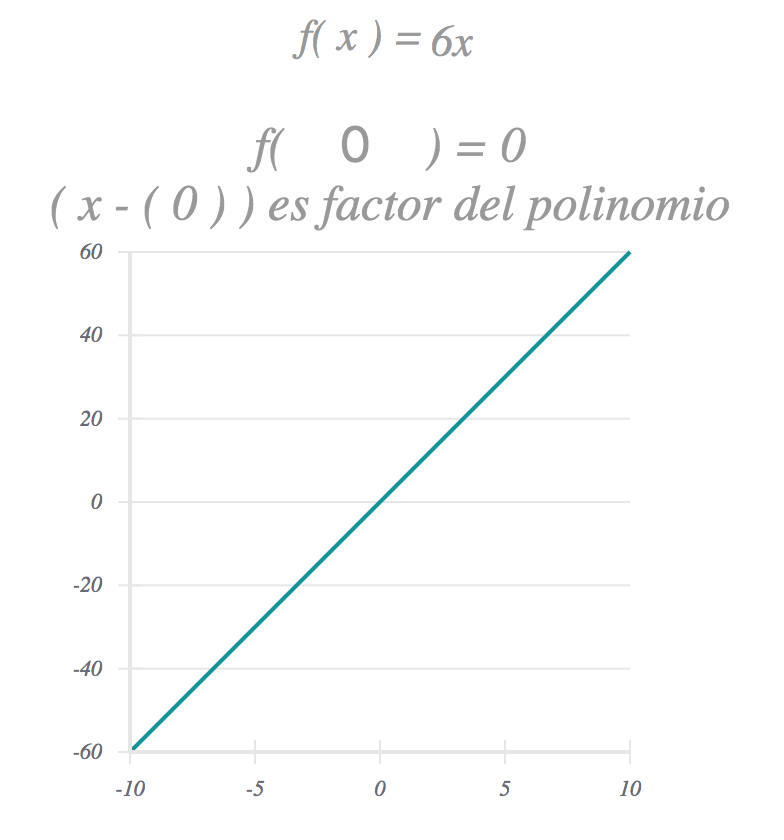

# Tarea 1 lógica III

Roger Sepúlveda



## Requerimientos

- Java 8
- [sbt](http://www.scala-sbt.org/0.13/docs/Installing-sbt-on-Linux.html)
- node y npm
```
curl -o- https://raw.githubusercontent.com/creationix/nvm/v0.33.1/install.sh | bash
# Cierre la consola y vuelva a entrar
nvm install stable
nvm use stable
```

Para correr la aplicación (puede tardar un poco la primera vez)
```
sbt fullOptJS
npm install
npm start

# Entre al navegador en http://localhost:8080, ahí verá la aplicación como se muestra en la imágen de mas arriba
```

## Uso

La aplicación es muy sencilla; consta de una simple caja de texto que interpreta
los polinomios que se ingresen. La sitaxis se entiende así

- Suma: `(polinomio)+(polinomio)` | `(x2-1)+(2)`
- Multiplicación: `(polinomio)*(polinomio)` | `(x2-1)*(2)`
- Derivada n-sima: `dnx(polinomio)` donde n es un entero, si se omite, se asume 1 | 1ra derivada: `dx(x3-1)` | 3ra derivada: `d3x(x3-1)` 
- Integral: `int(polinomio)` o bien `∫(polinomio)` | `∫(x3-1)`
- Integral definida: `int[linf,lsup](polinomio)` donde linf y lsup son los límites inferior y superior | `∫[1,2](x3-1)`  

Cuando el programa entiende la sintaxis, muestra el resultado bajo la caja de texto y muestra una segunda
en la que puede ingresar números para evaluar el polinomio en ese valor de x, se rechaza cualquier valor que no sea numerico

Si la evaluación del polinomio para una x dada es cero, le informará el factor del polinomio



## Desarrollo

La aplicación está desarrollada en varias tecnologías

- Lenguajes Scala y javascript
- En Scala se definió toda el álgebra de la aplicación incluído el parsing del string
- En javascript se definió todos los componentes gráficos

La clase de parseo se encuentra en `edu.udea.model.PolinomioParser` donde se ve la gramática definida
para el parseo de polinomios

Un polinomio es una lista de monomios, se encuentra en el paquete `edu.udea.model.polinomio`
donde se ve la definición del álgebra.

En cuanto a la interfaz gráfica, la aplicación inicia en `src/main/js/index.js`, se utilizó la librería 
React.js para definir los componentes gráficos.


http://cjtcs.cs.uchicago.edu/articles/CATS2009/3/cats9-3.pdf